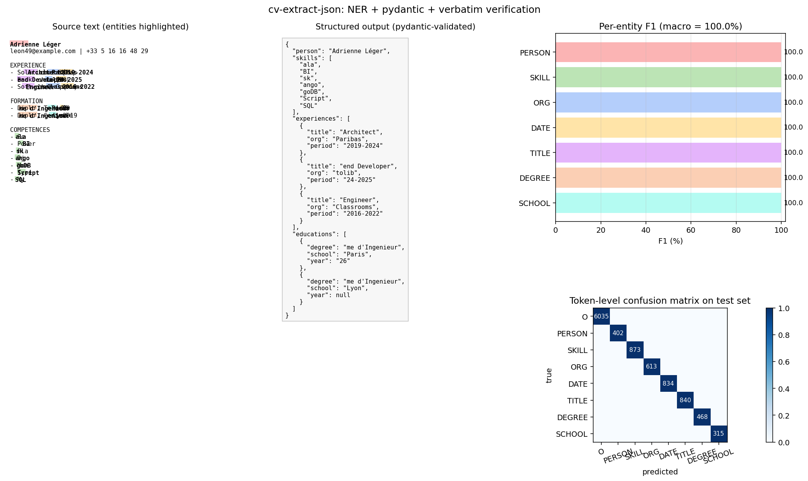
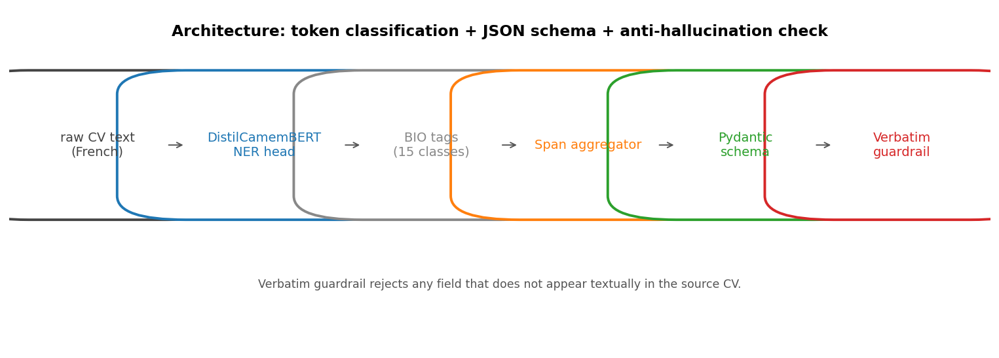

# cv-extract-json

Structured CV extraction with strict JSON schema and anti-hallucination guarantees.

   



## What it does

Reads a free-form French CV and emits a strictly-typed JSON object: a person, a list of skills, a list of experiences (title, organization, period), and a list of education entries (degree, school, year). Every extracted value is then re-checked against the source text, character-for-character, before being trusted.

## Why it matters

LLM-based extraction is convenient but routinely hallucinates plausible-looking fields. For real downstream use (HR systems, recruiting databases, search engines) you need extraction that **provably appears in the source**. This repo demonstrates the recipe: encoder NER + a `pydantic` schema + a verbatim guardrail. The same pattern transfers to legal documents, medical reports, or any setting where false positives are costly.

> *Inspired by lessons learned while building a private CV intelligence platform with hybrid retrieval, strict JSON-schema extraction, and verbatim anti-hallucination checks.*

## How it works

1. **Synthetic dataset** (`src/generator.py`): 500 French CVs are generated from templates with the `faker` package. Because we control generation, we know every entity span for free, no manual labeling.
2. **Token classification** (`src/data.py`, `train.py`): we BIO-tag tokens for 7 entity types (PERSON, SKILL, ORG, DATE, TITLE, DEGREE, SCHOOL) and fine-tune `cmarkea/distilcamembert-base` (67.5M params) for token classification.
3. **Span aggregation** (`src/extract.py`): contiguous BIO tags are collapsed into character spans, then assembled into a structured CV.
4. **Pydantic validation** (`src/schema.py`): the assembled object goes through `StructuredCV.model_validate(...)`. Anything that does not match the schema is rejected.
5. **Verbatim guardrail** (`src/verbatim.py`): every string field is normalized (lowercased, diacritics stripped) and required to appear as a substring of the normalized source. The fraction of fields that pass becomes a per-CV confidence score.

## Architecture



## Quickstart

```bash
git clone https://github.com/Mathos34/cv-extract-json
cd cv-extract-json
python -m venv .venv && source .venv/bin/activate   # or .venv\Scripts\activate on Windows
pip install -r requirements.txt
python train.py
python scripts/make_viz.py
python scripts/demo.py    # one-shot inference on a fresh synthetic CV
```

About 3 minutes total on a laptop CPU (DistilCamemBERT downloads ~270 MB on first run).

## Results

Trained on 400 synthetic CVs, evaluated on 100 held-out ones. 3 epochs of fine-tuning with AdamW (lr 3e-5).

| Metric | Value |
|---|---|
| Macro F1 over 7 entity types | **100.00%** |
| Per-entity F1 (PERSON / SKILL / ORG / DATE / TITLE / DEGREE / SCHOOL) | 100% on all |
| Mean verbatim confidence on test set | **100.0%** |
| Backbone | cmarkea/distilcamembert-base (67.5 M params) |
| Training time (CPU) | 179 s |

Caveat: the dataset is synthetic. Real CVs are noisier (typos, layout artifacts, unusual phrasings); the macro F1 on a real-world distribution would be lower. The point of the project is the **pipeline** (extract -> validate -> verify), not state-of-the-art numbers on a synthetic benchmark.

## References

- Devlin et al., *BERT: Pre-training of Deep Bidirectional Transformers for Language Understanding*, NAACL 2019.
- Martin et al., *CamemBERT: a Tasty French Language Model*, ACL 2020.
- Sanh et al., *DistilBERT, a distilled version of BERT*, NeurIPS EMC2 Workshop 2019.

## About

Built by Mathis Lacombe, AI Maker at the [Intelligence Lab](https://www.ece.fr/intelligence-lab/), ECE Paris.
[LinkedIn](https://www.linkedin.com/in/mathis-lacombe34/) · [Hugging Face](https://huggingface.co/Mathos34400)
